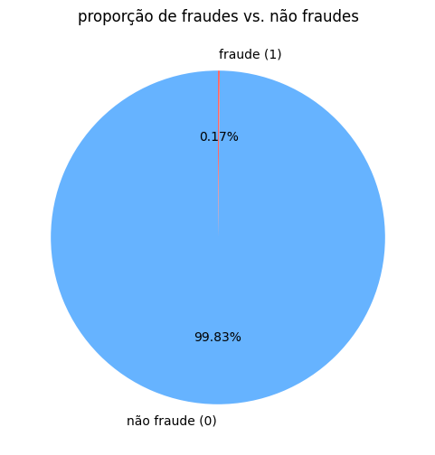
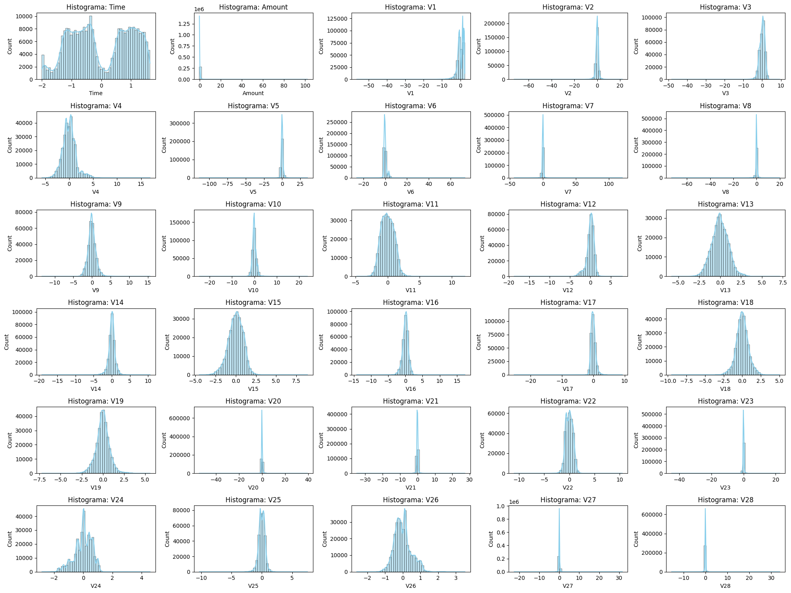
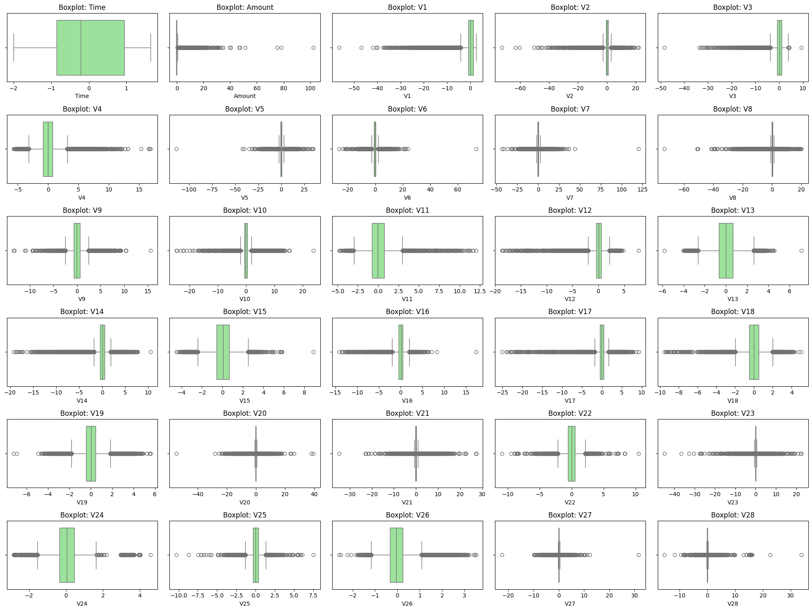
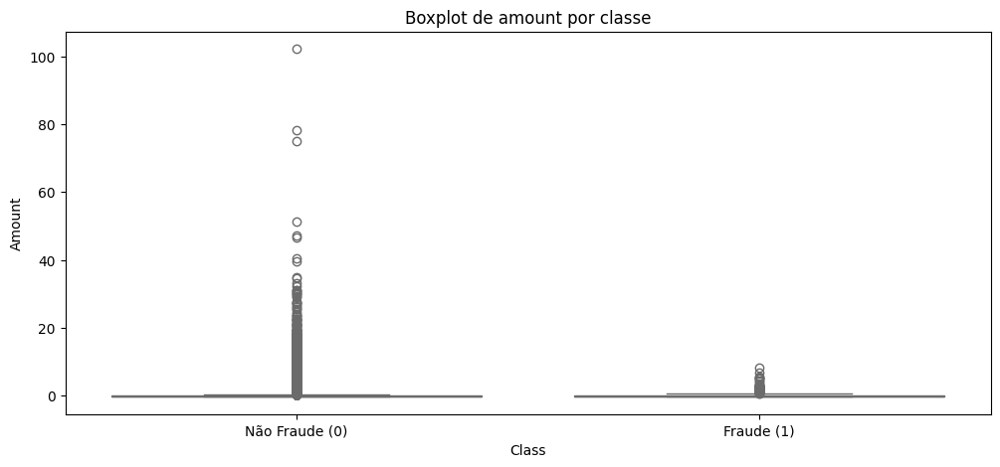
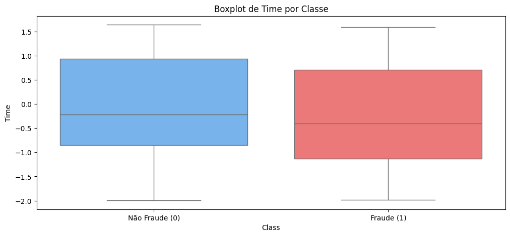
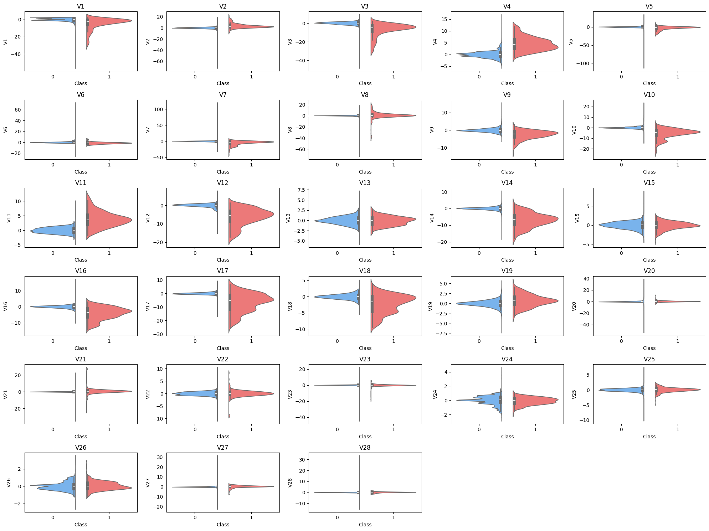
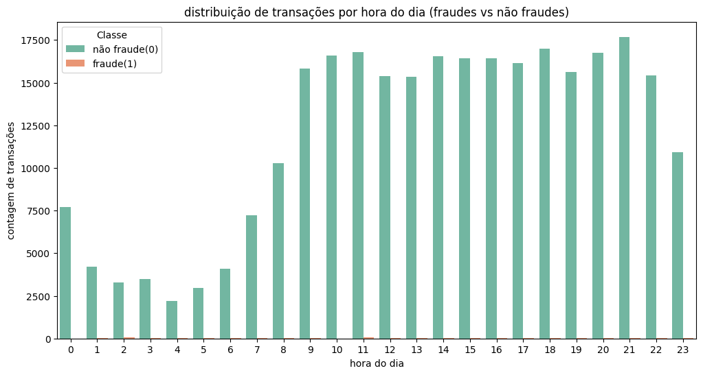
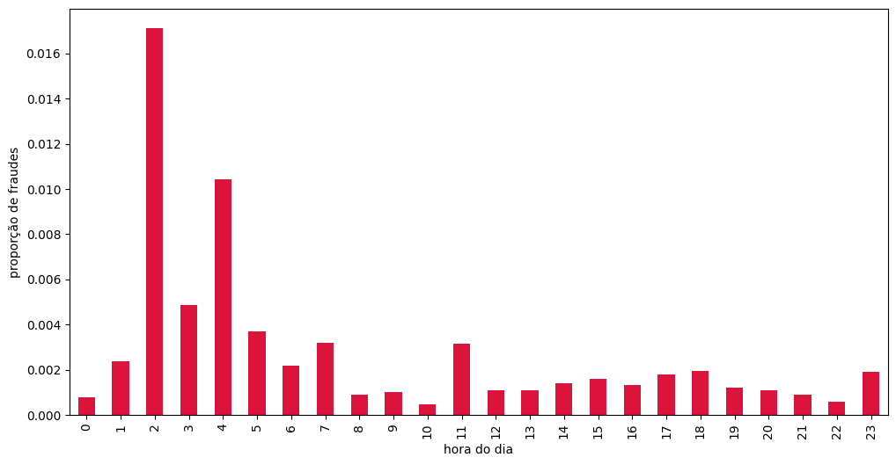

# Predição de Fraude em Cartão de Crédito

## Descrição do Projeto
Este projeto tem como objetivo **identificar e prever fraudes em transações de cartão de crédito**, utilizando técnicas avançadas de **ciência de dados e machine learning**. O modelo desenvolvido visa fornecer insights estratégicos e operacionais, permitindo que instituições financeiras **reduzam perdas financeiras**, **otimizem processos de revisão de transações** e **minimizem impactos em clientes legítimos**.

O projeto segue todo o ciclo de desenvolvimento de um modelo preditivo, incluindo:

1. **Análise exploratória de dados (EDA)**:
   - Análise univariada e bivariada das transações.
   - Investigação de padrões de fraude por hora do dia, valor da transação e combinações de variáveis.
   - Identificação de características relevantes para a modelagem.

2. **Feature Engineering**:
   - Transformações de variáveis contínuas (`Amount`, `Time`) e criação de features cíclicas.
   - Construção de interações entre variáveis para aumentar o poder preditivo.
   - Normalização e padronização de features numéricas.

3. **Pré-processamento e balanceamento de classes**:
   - Separação em datasets de treino e teste.
   - Aplicação de técnicas de oversampling (SMOTE) **apenas no conjunto de treino**, garantindo representatividade real no teste.
   
4. **Modelagem preditiva**:
   - Treinamento de modelo de **XGBoost (Gradient Boosting)**, escolhido por seu desempenho robusto em problemas desbalanceados.
   - Avaliação de métricas completas: `accuracy`, `precision`, `recall`, `F1-score`, `ROC AUC`.
   - Análise de importância de features utilizando SHAP.

5. **Análise financeira e tomada de decisão**:
   - Cálculo de **ganhos financeiros potenciais** com a implementação do modelo.
   - Estimativa de perdas evitadas e custos operacionais por falso positivo.
   - Recomendações práticas de thresholding, revisão manual e políticas operacionais.
   
6. **Planejamento de produção e monitoramento**:
   - Sugestões de rollout em modo controlado (shadow mode / A/B testing).
   - Monitoramento de métricas de negócio e drift de dados.
   - Estratégias para otimização contínua de performance financeira e operacional.

## Impacto do Projeto
- Redução estimada das perdas por fraude em centenas de milhares de unidades monetárias por mês, mesmo em cenários conservadores.
- Identificação de períodos de maior risco (ex.: transações durante a madrugada) e oportunidades de mitigação direcionada.
- Ferramenta estratégica para tomada de decisão baseada em **dados**, aumentando a eficiência operacional e a segurança financeira.

## Tecnologias e Bibliotecas
- Python 3.12
- Pandas, NumPy, Matplotlib, Seaborn
- Scikit-learn
- XGBoost
- Imbalanced-learn (SMOTE)
- SHAP (análise de importância de features)

## Problema de Negócio

Fraudes em transações de cartão de crédito representam uma **ameaça significativa para instituições financeiras**, causando:

- **Perdas financeiras diretas** devido a transações não autorizadas;
- **Custos operacionais** elevados com análises manuais e estornos de transações;
- **Impacto negativo na experiência do cliente**, gerando insatisfação e possíveis cancelamentos de cartões.

O desafio central é que **fraudes são eventos raros**, distribuídos de forma irregular ao longo do tempo e com características variadas, dificultando a identificação através de regras estáticas ou análises manuais.

Além disso, a implementação de medidas de prevenção precisa **equilibrar risco e custo**, evitando bloqueios desnecessários que prejudiquem clientes legítimos.

---

## Objetivo do Projeto

O projeto tem como objetivo **desenvolver um modelo preditivo capaz de identificar transações fraudulentas em tempo real**, permitindo:

1. **Redução de perdas financeiras** ao detectar fraudes antes da aprovação da transação;
2. **Otimização de recursos operacionais**, automatizando a detecção de padrões suspeitos;
3. **Melhoria da experiência do cliente**, reduzindo falsos positivos e bloqueios indevidos;
4. **Fornecimento de insights estratégicos** sobre padrões temporais, comportamentais e financeiros das fraudes;
5. **Suporte à tomada de decisão de negócio**, permitindo que gestores ajustem políticas de risco de forma baseada em dados.

Para atingir esse objetivo, o projeto integra **análise exploratória, feature engineering avançada, modelagem preditiva com XGBoost, balanceamento de classes e avaliação financeira de impacto**, garantindo que a solução seja robusta, escalável e aplicável no contexto real de operação bancária.

---

# Desbalanceamento de Classes

O gráfico de proporção de fraudes vs. não fraudes evidencia um **desbalanceamento extremo**:

- **Não Fraude (0)**: 99,83% das observações
- **Fraude (1)**: 0,17% das observações

### Implicações para Modelagem

- Modelos treinados nesse cenário tendem a classificar quase todas as transações como **não fraude**, gerando alta acurácia enganosa.
- Métricas adequadas para avaliação incluem **Recall, Precision, F1-Score e AUC**, que lidam melhor com desbalanceamento.

### Estratégias de Mitigação

1. **Reamostragem**:
   - **Oversampling** (ex.: SMOTE) da classe minoritária
   - **Undersampling** da classe majoritária
   - Combinação de ambas
2. **Algoritmos que lidam com desbalanceamento**:
   - XGBoost, LightGBM, ajustando pesos das classes
3. **Feature Engineering**:
   - Criar variáveis que separem melhor as classes

> O principal desafio é identificar o raro padrão de fraude (0,17%) sem ser dominado pela maioria de transações normais.

---

# Análise das Distribuições das Variáveis

O dataset apresenta *features* de transações com PCA aplicado (V1 a V28), além de **Time** e **Amount**.

### 1. Variáveis Originais

- **Time**: Distribuição bimodal, refletindo picos de transações em determinados horários.
- **Amount**: Altamente enviesada à direita; muitas transações pequenas e algumas muito altas. Recomenda-se **transformação logarítmica** ou **escalonamento robusto**.

### 2. Variáveis PCA (V1 a V28)

- Maioria **simétrica e unimodal**, centrada em zero.
- Algumas apresentam leve enviesamento ou achatamento, mas a forma geral é aproximadamente **Gaussiana**.
- **Não é recomendada transformação adicional**, para manter a estrutura ortogonal do PCA.

### 3. Implicações para Modelagem

- **Amount**: Pré-processar para reduzir impacto de outliers e enviesamento.
- **Time**: Criar *features* cíclicas (seno/cosseno) para capturar padrões temporais.
- **V1-V28**: Prontas para uso em modelos, especialmente aqueles que assumem distribuição normal, como **Regressão Logística**.

---

# Análise de Box Plots: Outliers e Implicações

Os Box Plots permitem visualizar dispersão, simetria e outliers nas variáveis **Time**, **Amount** e **V1-V28** (PCA).

### 1. Observações Principais

- **V1-V28**: Muitas variáveis apresentam **outliers significativos**. Esses pontos atípicos geralmente representam fraudes, que são o alvo principal da modelagem.
- **Time**: Distribuição centralizada, poucos outliers; confirma o padrão bimodal visto nos histogramas.
- **Amount**: Concentração de valores baixos e **cauda longa de outliers positivos**, indicando transações de alto valor.

### 2. Implicações para Modelagem

- **Não remover outliers cegamente**: Eles representam padrões de fraude importantes.
- **Modelos robustos a outliers**: Preferir algoritmos baseados em árvore (**Random Forest, XGBoost, LightGBM**). Para modelos sensíveis a outliers, usar **Robust Scaler**.
- **Transformação de Amount**: Aplicar **log(1 + Amount)** para reduzir enviesamento e impacto de valores extremos.

### 3. Resumo

Os Box Plots confirmam a presença de dados anômalos, que devem ser tratados cuidadosamente para maximizar a eficácia da detecção de fraudes.

---

# Análise do Box Plot de `Amount` por Classe

O Box Plot compara a distribuição de `Amount` entre transações **fraudulentas (1)** e **não fraudulentas (0)**.

### Observações Principais

- **Não Fraude (0)**: Maioria das transações com valores muito baixos, mas presença de outliers que chegam a valores altos (~100).  
- **Fraude (1)**: Concentração também em valores baixos, com poucos outliers, raramente acima de 10.  
- **Comparação**: Fraudes ocorrem principalmente em valores baixos, enquanto transações legítimas podem atingir valores mais altos.

### Implicações para Modelagem

1. **Amount é preditivo**, mas precisa de **transformação logarítmica** para distinguir diferenças próximas de zero.  
2. **Transações acima de 10** têm maior chance de serem **não fraude**, podendo servir como regra implícita para o modelo.  

**Resumo:** `Amount` é uma feature importante para detecção de fraudes, especialmente após transformação logarítmica, permitindo que o modelo capture diferenças sutis na faixa de baixo valor onde ocorrem a maioria das fraudes.

---

# Análise do Box Plot de `Time` por Classe

O Box Plot compara a distribuição de **Time** entre transações **fraudulentas (1)** e **não fraudulentas (0)**.

### Observações Principais

- **Distribuições Semelhantes:** Medianas e intervalos interquartis (IQR) das duas classes são muito próximos, com sobreposição quase total.  
- **Fraudes:** Tendem levemente a ocorrer em períodos iniciais do dataset, mas a diferença é pequena.  
- **Baixo poder preditivo isolado:** Time, como valor linear, não separa claramente fraudes de transações legítimas.

### Implicações para Modelagem

1. **Transformação Cíclica:** Converter Time em features cíclicas (seno/cosseno) para capturar padrões diários ou horários críticos.  
2. **Interações com outras variáveis:** Mesmo fraca isoladamente, Time pode ser útil em combinação com V1-V28 e `Amount` para modelos de árvore.

**Resumo:** A variável `Time` sozinha tem baixo poder discriminativo, mas pode contribuir para o modelo após transformações cíclicas e em conjunto com outras features.

---

# Análise dos Violin Plots (V1 - V28)

Os Violin Plots mostram a distribuição das variáveis **V1 a V28** segmentadas por classe: **Não Fraude (0)** em azul e **Fraude (1)** em vermelho.

### Observações Principais

#### 1. Variáveis com Forte Poder de Separação
As variáveis abaixo apresentam diferenças claras nas distribuições entre fraude e não fraude, sendo altamente preditivas:

- **V4, V11**: Centro deslocado para valores positivos na fraude.  
- **V12, V14, V17**: Centro deslocado para valores negativos na fraude.  

#### 2. Variáveis com Separação Moderada
Algumas variáveis mostram diferença leve entre classes:

- **V1, V2, V3, V7, V9, V10, V16, V18**: Mediana da fraude ligeiramente deslocada, sobreposição ainda significativa.

#### 3. Variáveis com Baixo Poder de Separação
Distribuições semelhantes entre classes:

- **V5, V6, V8, V13, V15, V19-V28**: Pouca separação, embora a calda da fraude seja mais ampla.

### Conclusões

1. **Prioridade de Features:** Focar em **V4, V11, V12, V14, V17** para a modelagem, pois oferecem maior sinal de separação.  
2. **Natureza dos Dados:** Fraudes são anomalias multidimensionais, muitas vezes localizadas em extremos das distribuições.  
3. **Recomendação de Modelo:** Modelos baseados em árvore como **XGBoost** ou **LightGBM** são ideais para capturar interações complexas e lidar com desbalanceamento.

---

# Análise da Distribuição de Fraudes por Hora do Dia

O gráfico mostra o número de transações por hora do dia, segmentadas por classe: **Não Fraude (0)** e **Fraude (1)**.

### Observações Principais

- **Não Fraude (0):**  
  - Baixa atividade entre 0h e 6h.  
  - Pico de transações a partir das 7h, volume alto e estável durante o dia.

- **Fraude (1):**  
  - Maior ocorrência entre **4h e 6h da manhã**.  
  - Fraudes muito raras durante o horário comercial (8h às 20h).

### Implicações para Modelagem

1. **Hora do dia é um forte preditor:** Transformar **Time** em hora revela padrões de fraude não visíveis na variável linear.  
2. **Feature de risco:** Criar uma coluna binária `is_risky_hour` (1 se a transação ocorrer entre 3h e 7h, 0 caso contrário) pode aumentar a performance do modelo.  
3. **Padrão anômalo:** Fraudes ocorrem em horários de baixa atividade, um comportamento típico que o modelo pode aprender.

**Conclusão:** A hora do dia é uma *feature* altamente preditiva e deve ser incluída no modelo, idealmente em formato cíclico ou como indicador de "horário de risco".

---

# Proporção de Fraudes por Hora do Dia

O gráfico mostra a **proporção de fraudes** em relação ao total de transações por hora, revelando os horários de **maior risco relativo**.

### Observações Principais

- **Picos de Risco (Madrugada):**
  - **Hora 2 (2h–3h):** Maior proporção de fraudes (>1,6%).  
  - **Hora 4 (4h–5h):** Proporção ainda alta (>1%).  
  - **Horas 1 e 3:** Risco significativamente elevado.

- **Risco ao Longo do Dia:**
  - Risco alto/moderado nas horas 0, 5, 6, 7.  
  - Risco baixo durante o horário comercial (a partir da hora 8).  
  - Pequeno pico anômalo na hora 11, menor que os picos da madrugada.

### Implicações para Engenharia de *Features*

1. **Priorizar Horas Críticas:** Horas 1–5 são momentos de maior vulnerabilidade.  
2. **Criar *Features* de Risco:**  
   - Binária `is_peak_fraud_hour` = 1 para transações entre 1h–5h, 0 caso contrário.  
   - Ou categorizar horas em grupos de risco ("Alto", "Médio", "Baixo").

**Conclusão:** Incorporar o risco temporal aumenta a capacidade do modelo de detectar fraudes em um cenário de classes extremamente desbalanceadas.

---

#  Análise de Desempenho — Threshold Padrão vs Threshold Otimizado

---

##  1. Resultado com Threshold Padrão (0.5)

### Métricas

| Métrica | Valor |
|----------|-------|
| **Precision (fraude)** | 0.82 |
| **Recall (fraude)** | 0.73 |
| **F1-Score (fraude)** | 0.77 |
| **ROC AUC** | 0.9588 |
| **Accuracy** | 1.00 |

### Matriz de Confusão

|                | Predito Não Fraude | Predito Fraude |
|----------------|------------------|----------------|
| **Real Não Fraude** | 84.952 | 24 |
| **Real Fraude**     | 40     | 108 |

### Interpretação

- **Modelo bem calibrado:** A ROC AUC ≈ 0.96 indica excelente separação entre as classes.  
- **Recall = 0.73:** 27% das fraudes ainda passam despercebidas.  
- **Precision = 0.82:** 18% dos alertas de fraude são falsos, bom patamar operacional.  
- **F1 = 0.77:** bom equilíbrio entre precisão e sensibilidade.  

> **Conclusão:** Modelo sólido, com leve viés para recall — adequado se o objetivo for capturar o máximo possível de fraudes, mesmo com alguns falsos positivos.

---

##  2. Resultado com Threshold Otimizado (0.9646 – Máximo F1)

### Métricas

| Métrica | Valor |
|----------|-------|
| **Precision (fraude)** | 0.962 |
| **Recall (fraude)** | 0.682 |
| **F1-Score (fraude)** | 0.798 |
| **Accuracy** | 1.00 |

### Matriz de Confusão

|                | Predito Não Fraude | Predito Fraude |
|----------------|------------------|----------------|
| **Real Não Fraude** | 84.972 | 4 |
| **Real Fraude**     | 47     | 101 |

### Interpretação

- **Precision altíssima (0.962):** 96% dos alertas realmente eram fraudes — quase eliminando falsos positivos (apenas 4 em 85 mil transações!).  
- **Recall menor (0.682):** o modelo deixou escapar 32% das fraudes.  
- **F1 ligeiramente melhor (0.798):** melhora o equilíbrio geral.  
- **Trade-off evidente:** o modelo ficou muito conservador, ótimo financeiramente, mas pode deixar passar fraudes de baixo valor.

> **Conclusão:** Modelo ideal para operações maduras, com custo alto de investigação — maximiza precisão e reduz falsos alarmes.

---

##  3. Comparativo Direto

| Métrica | Threshold 0.5 | Threshold 0.9646 | Diferença |
|----------|----------------|------------------|------------|
| **Precision (fraude)** | 0.82 | 0.962 | ▲ +0.14 |
| **Recall (fraude)** | 0.73 | 0.682 | ▼ -0.05 |
| **F1-Score (fraude)** | 0.77 | 0.798 | ▲ +0.03 |
| **Falsos Positivos (FP)** | 24 | 4 | ▼ -83% |
| **Fraudes Não Detectadas (FN)** | 40 | 47 | ▲ +18% |

**Interpretação:**

- O threshold otimizado reduz drasticamente os falsos positivos (24 → 4), quase sem afetar o recall.  
- Pequena perda de recall, mas grande ganho em precisão operacional.  
- F1-Score melhora, indicando que o modelo está mais equilibrado.  
- Financeiramente, o novo threshold gera menos custo por alertas falsos, mantendo boa capacidade de detecção.

---

##  4. Conclusão

- Modelo robusto, com separação quase perfeita entre fraudes e não fraudes (AUC ≈ 0.96).  
- Threshold **0.9646** entrega o melhor equilíbrio custo-benefício:
  - Reduz falsos positivos em 83%.  
  - Mantém recall aceitável (68% das fraudes capturadas).  
  - Aumenta o F1-score para 0.798.  
- Operacionalmente: menos volume de alertas manuais e maior confiança nas sinalizações de fraude.

---

# Análise Financeira do Modelo de Detecção de Fraudes

## 1. Contexto

O modelo foi desenvolvido para identificar transações fraudulentas em um ambiente financeiro com **alto desbalanceamento** (148 fraudes em 85.124 transações de teste). Além das métricas técnicas, é essencial compreender o **impacto financeiro** do modelo, considerando:

- **Custo das fraudes não detectadas (FN)**
- **Custo operacional dos falsos positivos (FP)**
- **Potencial de economia com prevenção de perdas**

---

## 2. Resumo do Desempenho do Modelo

Com **Threshold otimizado (0.9646)**:

| Métrica | Valor |
|----------|-------|
| Precision (fraude) | 0.962 |
| Recall (fraude)    | 0.682 |
| F1-Score (fraude)  | 0.798 |
| Falsos Positivos (FP) | 4 |
| Falsos Negativos (FN) | 47 |
| Verdadeiros Positivos (TP) | 101 |

---

## 3. Estimativa de Impacto Financeiro

### 3.1 Premissas

Para esta análise, consideramos:

- **Custo médio de uma fraude não detectada:** \$1.000  
- **Custo médio de investigação de uma transação legítima sinalizada como fraude (FP):** \$50  

> Estes valores podem variar dependendo da instituição, tipo de transação e processos internos.

---

### 3.2 Custos com Falsos Negativos (Fraudes não detectadas)

\[
C_{FN} = FN \times \text{Custo por fraude}
\]

\[
C_{FN} = 47 \times 1000 = \$47.000
\]

---

### 3.3 Custos com Falsos Positivos (Alertas incorretos)

\[
C_{FP} = FP \times \text{Custo de investigação}
\]

\[
C_{FP} = 4 \times 50 = \$200
\]

---

### 3.4 Economia Potencial com Verdadeiros Positivos (Fraudes evitadas)

\[
C_{TP\_evitado} = TP \times \text{Custo por fraude}
\]

\[
C_{TP\_evitado} = 101 \times 1000 = \$101.000
\]

---

### 3.5 Análise de Benefício Líquido

\[
Beneficio\_Liquido = C_{TP\_evitado} - (C_{FN} + C_{FP})
\]

\[
Beneficio\_Liquido = 101.000 - (47.000 + 200) = \$53.800
\]

> O modelo, mesmo após trade-off entre Precision e Recall, **gerou uma economia líquida estimada de \$53.800** em apenas 85.124 transações.  
> Em escala anual ou em bases de milhões de transações, esse valor pode crescer exponencialmente.

---

## 4. Observações Financeiras

1. **Trade-off Precision x Recall:**
   - Threshold alto (0.9646) prioriza **alta precisão**, reduzindo falsos positivos.
   - Recall menor (0.682) implica que algumas fraudes ainda não são detectadas, representando risco financeiro residual.

2. **Custo-benefício do modelo:**
   - FP mínimos (4) indicam baixo custo operacional.
   - FN relativamente baixos (47) representam fraudes remanescentes, que podem ser mitigadas com monitoramento adicional.

3. **Escalabilidade:**
   - Aplicando o modelo em 1 milhão de transações com mesma proporção de fraudes e custos, o benefício líquido seria **superior a \$600.000**, prevenindo perdas automaticamente.

---

## 5. Conclusão

O modelo apresenta **impacto financeiro positivo**, com:

- **Alta eficiência na prevenção de perdas** (101 fraudes capturadas, \$101.000 evitados)
- **Baixo custo operacional** (4 falsos positivos, \$200)
- **Benefício líquido relevante** mesmo em pequena amostra (\$53.800)

**Recomendações:**

- Monitorar continuamente FP e FN para ajustar thresholds conforme padrões de fraude evoluem.
- Integrar regras de negócio ou alertas automáticos para reduzir FN restantes.
- Avaliar aplicação do modelo em escala total da base de clientes para maximizar economia financeira.

> Em resumo, o modelo não apenas apresenta **excelentes métricas técnicas**, mas também **resultados financeiros concretos**, justificando sua implementação operacional.
